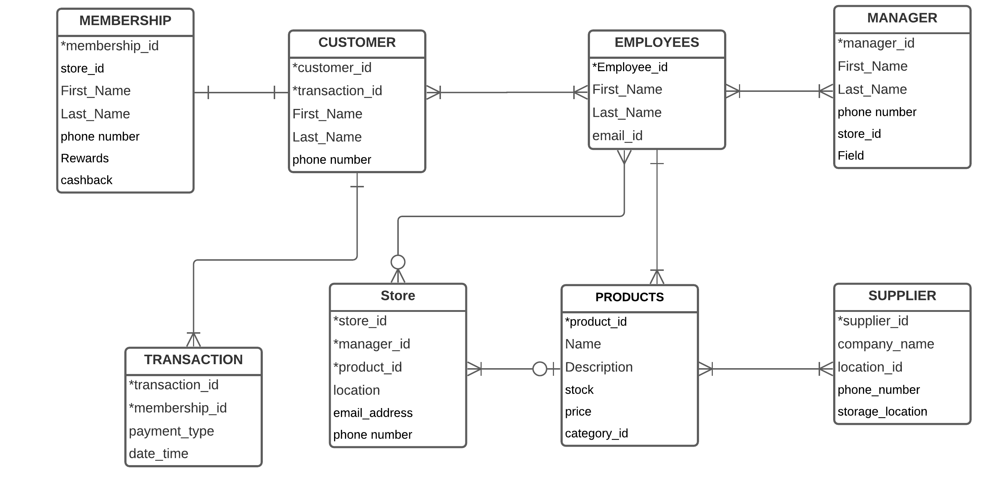

# Week_7_Assignment
## week-07_group_activity
### 1. Create an account on lucidchart.com and create an ERD diagram for the following scenario:
### A grocery store owner would like to store all their data in a database. Some importan facts you need to include are
### 1) The owner has multiple stores
### 2) The owner has multiple employees and the managers report to him, but all other employees report to store managers
### 3) The store has a membership program, but not all customers need to be members

### 2. With your group, create a list of at least 5 and no more than 10 ways data can be “dirty”. Perhaps think back to some data sets we have used that have had weird stuff in them. Discuss how you would resolve each of these and briefly explain.

Dirty data is simply the missing, duplicated or inaccurate data.

Eg of dirty data: 1) In our jeopardy data, i have found that there are 2 missing values in the 'Answer' column.
                  2) Also, One more thing that I’ve noticed is that there’s an extra space in the column names
                  viz., ' Air Date', ' Round', ' Category', ' Value', ' Question', ' Answer'  
                  
Oftentimes the source data comes with duplicate records and we need to remove such duplicates to
avoid data redundancy as our analysis with duplicates could lead to misleading insights.

Data which is incorrectly punctuated or incorrectly spelled are also common occurence of dirty data.

Incomplete data, where important fields on data records are left blank.This is one of the most common occurrence of dirty data.

Inconsistent data i.e.,same field values are stored in different places.

We certainly have some ways to resolve this issue to get clean data,

Data cleaning means to refine the raw or source data that is collected to render it to be 
leveraged for Data analysis to facilitate in retrieving meaningful insights and abstract visualizations.

Before we make any changes to our data, make a copy or backup of the data.

-Identify and remove the duplicate data 

-Identify and fix the issues with spaces and spelling

-Fix the issues with missing data, for example in numerical data by setting a value to zero, or setting a word 'missing' for character data.

-Normalizing the data, for example if the data has a number make sure it is a number. often imes will see 'five' instead of 5 or a blank instead if 0.

### 3. Look at the requirements for the exploratory data analysis project. List at least 2 APIs thathave data interesting to you. Please pick at least one API that’s not listed in the project instructions.

3a) From the list of APIs provided by you, i would like to choose: Quandl stock/finacila api.  
Quandl stock/financial API - https://www.quandl.com/tools/api

3b) Based upon my interest, i am planning to opt the below api for Zillow real estate data.
Real Estate Data, Mortgage Data, API|Zillow - https://www.zillow.com/howto/api/APIOverview.htm

