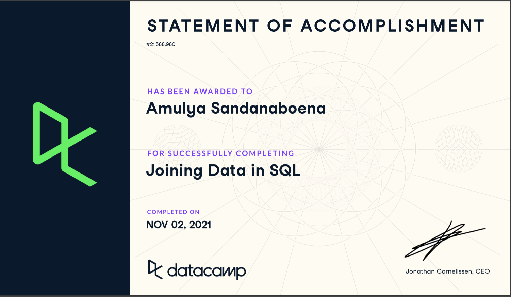
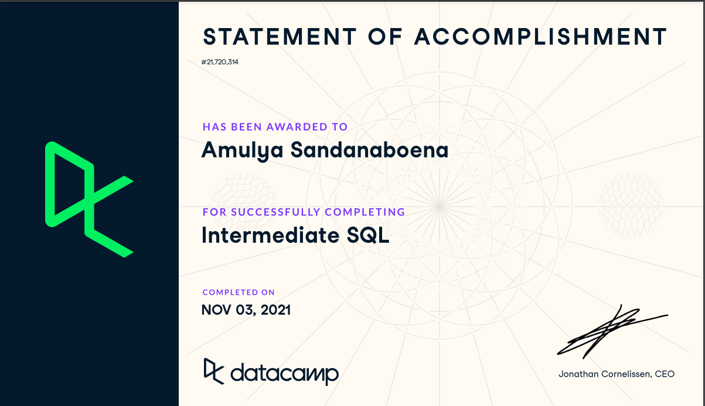

### 1.Create a new column called “status” in the rental table that uses a case statement to indicate if a film was returned late, early, or on time. 

STEP1. To create a new column within the rental table we can use ALTER TABLE with name and add the column name as status and then update the 
       rental table by set statement and case statement to indicate if a film was returned Early, Late and On time.

STEP2. Tables we need film >inventory>rental 

STEP3. key to join film >inventory is by(film_id), key for inventory>rental is by(inventory_id).

STEP4. GROUP BY title and status, then ORDER BY status to get a new column as status.

#### Below is the query I used to answer the question-1:

ALTER TABLE rental

ADD status varchar(20);

UPDATE rental

SET status =

CASE WHEN DATE_PART('day', return_date - rental_date) < rental_duration THEN 'Early Return' 
  
WHEN DATE_PART('day', return_date - rental_date) = rental_duration THEN 'On time'
     
ELSE 'Late Return' END 
     
FROM film;

SELECT

f.title,
  
r.status
  
FROM film AS f

INNER JOIN inventory AS i

ON f.film_id = i.film_id

INNER JOIN rental AS r

ON i.inventory_id = r.inventory_id

GROUP BY r.status, f.title

ORDER BY r.status;

    
### 2.Show the total payment amounts for people who live in Kansas City or Saint Louis

STEP1. Tables we need customor>address>city>payment 

STEP2. I found key to join customor>address is by(address_id), key for address>city 
		 is by(city_id) and key to join city>payment tables by(customer_id) .
     
STEP3. To find the total payment amounts for people who live in Kansas City or Saint Louis, use the WHERE clause in city.

STEP4. Using GROUP BY customer_name, city_id and city will get the required information.

STEP5. Finally using the select statement i mentioned all the fields that i need to get in output.

#### Below is the query I used to answer the question-2:

SELECT concat(c.first_name, ' ', c.last_name) AS customer_name, cy.city_id, city, SUM(amount) AS total_payment

FROM customer AS c

INNER JOIN address AS a

ON c.address_id = a.address_id

INNER JOIN city AS cy

ON a.city_id = cy.city_id

INNER JOIN payment AS p

ON c.customer_id = p.customer_id

WHERE cy.city IN ('Saint Louis', 'Kansas City')

GROUP BY customer_name, cy.city_id, city;    

### 3.How many films are in each category? Why do you think there is a table for category and a table for film category?

STEP1. Tables we need category>film_category

STEP2. I found key to join category>film_category is by(category_id).

STEP3. using the select statement to get the COUNT(film_id) AS number of films and the category of films.

STEP4. Using GROUP BY category and ORDER BY number of films will get the output. 

#### Below is the query I used to answer the question-3:

SELECT COUNT(fc.film_id) AS num_films, c.name AS category

FROM category AS c

INNER JOIN film_category AS fc

ON c.category_id = fc.category_id

GROUP BY category

ORDER BY num_films;

AS per my observation, film_category serves as a link between film and category tables. we can use the columns film_id and 
category_id to join the film table and category tables respectively.

### 4.Show a roster for the staff that includes their email, address, city, and country (not ids)

STEP1. Tables we need staff>address>city>country

STEP2. The key to join staff>address by(address_id), key to join address>city by(city_id), key to join city>country by(country_id).

STEP3. With the SELECT statement select all the fields that we want for the staff in our output.

#### Below is the query I used to answer the question-4:

SELECT first_name, last_name, email, address, city, cu.country

FROM staff AS s

INNER JOIN address AS a

ON s.address_id = a.address_id

INNER JOIN city AS c

ON a.city_id = c.city_id

INNER JOIN country AS cu

ON c.country_id = cu.country_id;

### 5.Show the film_id, title, and length for the movies that were returned from May 15 to 31, 2005

STEP1. Tables we need film>inventory>rental

STEP2. SELECT the fields that we need in output

STEP3. The key to join film>inventory by(film_id), key to join inventory>rental by(inventory_id)

STEP4. Using WHERE clause will get all the return_dates from May 15 to 31, 2005

STEP5. GROUP BY film_id and return_date then, ORDER BY return_date to get the return dates of the movies. 

#### Below is the query I used to answer the question-5:

SELECT f.film_id, f.title, f.length, r.return_date

FROM film AS f

INNER JOIN inventory AS i

ON f.film_id = i.film_id

INNER JOIN rental AS r

ON i.inventory_id = r.inventory_id

WHERE return_date BETWEEN '2005-05-15' AND '2005-05-31'

GROUP BY f.film_id, r.return_date

ORDER BY return_date ASC;
 

### 6.Write a subquery to show which movies are rented below the average price for all movies.

STEP1. SELECT the required fields from the film table.

STEP2. Here, we use a subquery in the where clause, and the purpose is to display the average rental rate of the movies and filtering out the ones which are less than the rental rate.

#### Below is the query I used to answer the question-6:

SELECT title, rental_rate

FROM film

WHERE rental_rate <

(SELECT AVG(rental_rate)
  
 FROM film);

### 7.Write a join statement to show which movies are rented below the average price for all movies.

STEP1. SELECT the average price for all movies using the aggregate function AVG with rental rate to get avg price.

STEP2. SELECT the fields that we need in output from the film table.

STEP3. Using CROSS JOIN, join f1 and f2.

STEP4. Use the GROUP BY statement with title and film_id then, HAVING clause is applied on rental rate and average price, 
	     filtering out the rows that don't match the specified conditions, finally, ORDER BY film_id to get the rental_rate and avg price for all the movies.

#### Below is the query I used to answer the question-7:

SELECT f2.film_id, f2.title, f2.rental_rate, AVG(f1.rental_rate) AS avg_price

FROM film AS f1

CROSS JOIN film AS f2

GROUP BY f2.film_id, f2.title

HAVING f2.rental_rate < AVG(f1.rental_rate)

ORDER BY film_id;

### 8.Perform an explain plan on 6 and 7, and describe what you’re seeing and important ways they differ

The EXPLAIN keyword, in SQL gives the description of how the queries are executed by the databases. 

It is used to get all the information about the SQL query.

It is used in the beginning of th query, before the SELECT statement. 

By using EXPLAIN, we can get the details of its execution step by step, instead of usual result output.

When we use EXPLAIN with ANALYZE option, the query is executed and timing information was captured (actual time=0.386..0.636 rows=341 loops=1)
means that the index scan was executed 1 time (the loops value), that it returned 341 rows, and that the actual time was 0.372..0.594.

They differ in Actual time, Planning time and Execution time, where it is less for subquery when compared to join.

#### Below is the query I used to answer the question-8(a):

STEP1. SELECT the required fields from the film table.

STEP2. Here, we use a subquery in the where clause, and the purpose is to display the average rental rate of the movies and filtering out the ones which are less than the rental rate.

EXPLAIN 

SELECT title, rental_rate

FROM film

WHERE rental_rate <

(SELECT AVG(rental_rate)
  
FROM film);
  
  #### QUERY PLAN
  
"Seq Scan on film  (cost=66.51..133.01 rows=333 width=21)"

"  Filter: (rental_rate < $0)"

"  InitPlan 1 (returns $0)"

"    ->  Aggregate  (cost=66.50..66.51 rows=1 width=32)"

"          ->  Seq Scan on film film_1  (cost=0.00..64.00 rows=1000 width=6)"

#### Below is the query I used to answer the question-8(b):

STEP1. SELECT the average price for all movies using the aggregate function AVG with rental rate to get avg price.

STEP2. SELECT the fields that we need in output from the film table.

STEP3. Using CROSS JOIN, join f1 and f2.

STEP4. Use the GROUP BY statement with title and film_id then, HAVING clause is applied on rental rate and average price, 
	     filtering out the rows that don't match the specified conditions, finally, ORDER BY film_id to get the rental_rate and avg price for all the movies.
       
       
EXPLAIN 

SELECT f2.film_id, f2.title, f2.rental_rate, AVG(f1.rental_rate) AS avg_price

FROM film AS f1

CROSS JOIN film AS f2

GROUP BY f2.film_id, f2.title

HAVING f2.rental_rate < AVG(f1.rental_rate)

ORDER BY film_id;

 #### QUERY PLAN

"Sort  (cost=22662.78..22663.62 rows=333 width=61)"

"  Sort Key: f2.film_id"

"  ->  HashAggregate  (cost=22630.50..22648.83 rows=333 width=61)"

"        Group Key: f2.film_id, f1.release_year"

"        Filter: (f2.rental_rate < avg(f1.rental_rate))"

"        ->  Nested Loop  (cost=0.00..12630.50 rows=1000000 width=35)"

"              ->  Seq Scan on film f1  (cost=0.00..64.00 rows=1000 width=10)"

"              ->  Materialize  (cost=0.00..69.00 rows=1000 width=25)"

"                    ->  Seq Scan on film f2  (cost=0.00..64.00 rows=1000 width=25)"

### 9.With a window function, write a query that shows the film, its duration, and what percentile the duration fits into. 

In SQL, window functions are used to perform calculations, similar to aggregate functions. But in aggregate functions, rows are grouped into a single output
row whereas in  window functions the rows retain their separate identities. 

we can use window functions to identify what percentile a given row falls into. The syntax is NTILE().
In this case, ORDER BY determines which column to use to determine the percentile.

#### Below is the query I used to answer the question-9:

 SELECT title AS film, length,
 
 NTILE(100) OVER (ORDER BY length)
       
 AS percentile_duration
         
 FROM film
  
 ORDER BY percentile_duration DESC;
 
 
 ### 10.In under 100 words, explain what the difference is between set-based and procedural programming. Be sure to specify which sql and python are.

Procedural programming is a "programmatic approach" that is used Python. In this approach we perform tasks in elementwise fashion. 
For instance, we use query, to perform data operations and manipulate using loops, conditions and then process the statements to give final result.
Set Based approach, actually allows us specify our requirement for processed result which has to be obtained from a set of data like a table, joins of table.

SQL is a very simple, yet powerful language and its a non-procedral language. 
We call SQL as a set-oriented language, as it is based on the mathematical theory of sets.
whereas Python support both Object Oriented and Procedural Programming language. 

### In the readme, explain what autoincrementing is. Also explain the difference between creating a join and a subquery. This section should be less than 300 words.

Auto incrementing is nothing but, generating a uniue number for every new record. By default the starting value is one and it will increment by one, but we can set our starting value as required, this feature is supported by all the Databases like SQL Server, MYSQL, PostgreSQL, MS Access, and Oracle.

For different databases, we have different keywords that are set for the Auto Increment feature. 

In PostgreSQL, SERIAL is the keyword used for auto incrementing, whereas in MS Access, AUTOINCREMENT is the keyword and in SQL Server, IDENTITY keyword is used.

#### The difference between creating a join and a subquery

In SQL, JOINS are used to combine one or more tables based on the match condition, and subquery is a query written inside another query that is we call it as nested query Subqueries are used to return either a single value or a row set. whereas joins are used to return rows. subquery can fit in any part of your query, such as the SELECT, FROM, WHERE, or GROUP BY clause. Whereas JOINS are used with FROM clause of the WHERE statement.
 
### SQL in DataCamp

